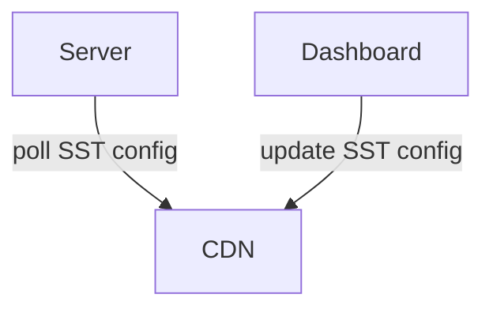

Symplify Server-Side Testing SDK
================================

https://symplify.com

For server-side testing, we provide SDKs for different platforms to be used in
your backend (web) servers to integrate A/B testing.

The server-side tests don't contain any customization code, only projects and
variations with IDs, names, and weights.

Architecture Overview
=====================

The SDK when initialized in your server keeps a small config in memory for the
active server-side tests on your website. You manage the tests in our dashboard,
and updates are published to our CDN.

The SDK periodically checks to ensure it has the current version of the config.

For each code path where you want to test different variations per visitor, you
need to ask the SDK for the variation allocation.

There is no need for any per-visitor storage, the allocation is idempotent. It
does depend on the variation weights in each project though, and distinct
visitor IDs. When you are running a test, know that adding or removing
variations or changing weights may change the variation a give visitor is
assigned. To ensure you don't have to keep track of visitor IDs in your code or
persistence, we integrate with HTTP cookies.

See the docs for each platform SDK for API specifics.
